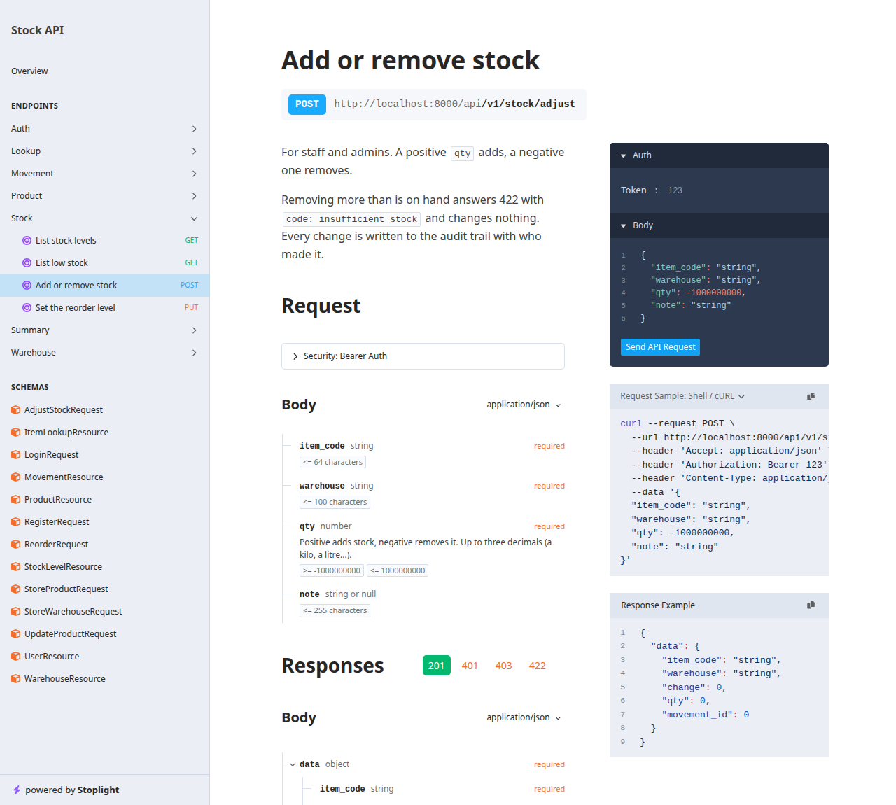

# Stock API

[](https://github.com/Klineyyy/stock-api/actions/workflows/ci.yml)

A REST API for a stockroom, built with **Laravel 13** and **PostgreSQL**: look an item up by barcode, add and remove stock per warehouse, see what's running low, and keep an audit trail of who changed what. It has JWT sign-in, three roles, generated OpenAPI documentation, and tests that fire ten real clients at the database at the same moment.

It answers the same requests as the [Inventory Hub](https://github.com/Klineyyy/inventory-hub) ERPNext app, with the same 12 demo items and barcodes as [Stock Scanner](https://github.com/Klineyyy/stock-scanner), so it can stand in for either one.



## Run it

You only need Docker.

```bash
docker compose up --build
```

Open <http://localhost:8000/docs/api> for the interactive documentation. The first start creates the tables and loads the demo data (12 items, 2 warehouses, 410 units, 5 of them running low).

Three demo accounts exist, all with the password `password`:

| Email | Role | Can |
| --- | --- | --- |
| `admin@example.com` | admin | everything, including the catalogue (products, warehouses, reorder levels) |
| `staff@example.com` | staff | read, and add or remove stock |
| `viewer@example.com` | viewer | read only |

Try it from a terminal:

```bash
# sign in and keep the token
TOKEN=$(curl -s localhost:8000/api/v1/auth/login -H 'Content-Type: application/json' \
  -d '{"email":"staff@example.com","password":"password"}' | jq -r .access_token)

# scan a barcode: the item and its stock in every warehouse
curl -s "localhost:8000/api/v1/lookup?code=4800010000122" -H "Authorization: Bearer $TOKEN" | jq

# take 2 units out
curl -s localhost:8000/api/v1/stock/adjust -H "Authorization: Bearer $TOKEN" -H 'Content-Type: application/json' \
  -d '{"item_code":"4800010000122","warehouse":"Stores - DRC","qty":-2,"note":"Sold"}' | jq

# what's running low, worst first
curl -s localhost:8000/api/v1/stock/low -H "Authorization: Bearer $TOKEN" | jq '.data[] | {item_code, warehouse, qty, reorder_level}'
```

In the docs page you can do the same by signing in through `POST /api/v1/auth/login` and pressing **Authorize** with the `access_token`.

## Endpoints

Everything is under `/api/v1` and needs a bearer token, except register and login.

| Method and path | Who | What it does |
| --- | --- | --- |
| `POST /auth/register` | anyone | Create an account (always a read-only viewer) |
| `POST /auth/login` | anyone | Get a token. Limited to 5 tries a minute per email and address |
| `GET /auth/me` | any role | The signed-in user |
| `POST /auth/refresh` | any role | Swap the token for a new one; the old one stops working |
| `POST /auth/logout` | any role | Invalidate the token straight away |
| `GET /lookup?code=` | any role | Find an item by barcode or item code, with stock per warehouse |
| `GET /summary` | any role | Item count, units on hand, low-stock count |
| `GET /stock` | any role | Stock per item and warehouse (`warehouse`, `low`, `search`, `per_page`) |
| `GET /stock/low` | any role | Rows at or below their reorder level, worst first |
| `GET /movements` | any role | The audit trail, newest first (`item_code`, `warehouse`) |
| `GET /products`, `GET /products/{code}` | any role | The catalogue, with search |
| `GET /warehouses` | any role | Warehouses |
| `POST /stock/adjust` | staff, admin | Add (positive `qty`) or remove (negative) stock |
| `POST /products`, `PATCH`, `DELETE /products/{code}` | admin | Manage the catalogue |
| `POST /warehouses` | admin | Add a warehouse |
| `PUT /stock/reorder` | admin | Set or clear an item's reorder level in a warehouse |

Lists are paginated: 15 a page, up to 100 with `per_page`.

### Errors

Every error is JSON with a human `message` and a stable `code` a client can switch on:

| Status | `code` | When |
| --- | --- | --- |
| 401 | `unauthenticated`, `invalid_credentials` | No token, a bad or expired token, wrong password |
| 403 | `forbidden` | The role can't do this |
| 404 | `not_found` | Unknown item or warehouse |
| 409 | `conflict` | Deleting a product that has stock or history |
| 422 | `validation_failed` | Bad input; `errors` names each field |
| 422 | `insufficient_stock` | Removing more than is on hand; nothing changes |
| 429 | `too_many_requests` | Rate limit (120 a minute; 5 a minute for login) |

## How it's built

```
app/
  Services/StockService.php      the one place stock changes (locking, exact maths, audit line)
  Http/Controllers/Api/V1/       thin controllers
  Http/Requests/                 validation, one class per input
  Http/Resources/                the JSON shapes
  Enums/Role.php                 admin, staff, viewer
  Exceptions/ApiException.php    expected errors with a stable code
  Console/Commands/AdjustStock   `php artisan stock:adjust`, same code path as the API
database/                        migrations, factories, demo seeder
tests/                           109 tests
```

Things worth knowing:

- **Two people can't take the last unit.** `StockService::adjust` runs in a transaction and reads the stock row with `SELECT ... FOR UPDATE`, so a second caller waits, then sees the real number. A row that doesn't exist yet is created first with `INSERT ... ON CONFLICT DO NOTHING`, so two first-time callers can't collide either. A `CHECK (qty >= 0)` in the database is the last line of defence.
- **Quantities are exact.** They're `numeric(14,3)` in PostgreSQL and added with `bcmath`, never as floats, so `0.1 + 0.2` is `0.3` and a kilo or a litre can be split into grams or millilitres.
- **Every change leaves an audit line** (who, how much, the quantity after, an optional note). A refused change leaves none, because it all happens in one transaction.
- **Permissions are read from the database, not from the token.** The role is also in the token so a client can show or hide buttons, but if someone is demoted, their old token stops working for admin actions immediately. New accounts can't pick their own role.
- **The documentation is generated from the code** by [Scramble](https://scramble.dedoc.co) (OpenAPI 3.1 at `/docs/api.json`), so it can't drift from the routes and validation rules.
- **Tests can't touch demo data.** The suite refuses to run unless the database name ends in `_test`, and `phpunit.xml` forces it to `stock_api_test` even when the environment says otherwise.

## Tests

```bash
docker compose run --rm app php artisan test      # 109 tests
docker compose run --rm app vendor/bin/pint --test   # code style
```

They cover sign-in, tokens, refresh and logout; a matrix of every endpoint against every role (and anonymous callers); validation of each input; stock changes including refusals and decimals; the queries and their filters; the audit trail; the docs; and the command-line tool.

The **concurrency tests** ([`tests/Feature/ConcurrencyTest.php`](tests/Feature/ConcurrencyTest.php)) start ten separate PHP processes against real PostgreSQL. Each one boots the app, waits for a shared start time, and adjusts stock through the same service the API uses:

- ten people each take 1 unit of an item that has 3: exactly three succeed, seven are refused, and stock ends at zero;
- ten people each add 1: stock ends at exactly 10, and the audit trail shows the quantities 1 to 10 with no repeats (no lost updates);
- ten first-ever additions to a warehouse that has no row: one row, 10 units, no duplicate-key errors.

To be sure these tests really catch the bug, I removed the `FOR UPDATE` lock and ran them: all three failed (ten people "took" the three units). I then replaced `ON CONFLICT DO NOTHING` with a check-then-insert, and the third test failed. Each worker pauses briefly after reading the stock row so that a missing lock shows up every time rather than one run in a hundred.

GitHub Actions ([`ci.yml`](.github/workflows/ci.yml)) runs the style check and the tests on PostgreSQL 16, and separately builds the Docker image, starts it, signs in and checks the demo numbers.

## Without Docker

You need PHP 8.4 (with `pdo_pgsql`, `bcmath`), Composer and a PostgreSQL 16 database.

```bash
composer install
cp .env.example .env               # then set DB_* to your database
php artisan key:generate
php artisan jwt:secret
php artisan migrate --seed
php artisan serve
```

For the tests, create a second database named `stock_api_test` and run `php artisan test`.

### From the command line

```bash
docker compose exec app php artisan stock:adjust BOND-A4 "Stores - DRC" 5 --note="Delivery"
docker compose exec app php artisan stock:adjust -- BOND-A4 "Stores - DRC" -3    # `--` because -3 looks like an option
```

## Limits

- The demo keys (`APP_KEY`, `JWT_SECRET`) and the database password are in `docker-compose.yml` so that it runs with one command. They are for the demo only; generate your own for anything real.
- The Docker image serves with PHP's built-in server, which is fine for a demo and for development but not for production traffic. Put PHP-FPM or Octane behind a proper web server for that.
- Anyone can register, but only as a read-only viewer. There is no endpoint to promote a user yet; an admin does it in the database.
- There are no soft deletes: a product with any stock or history can't be deleted, and one without can.
- Not deployed anywhere: it needs a PostgreSQL database, and it runs locally in one command.
